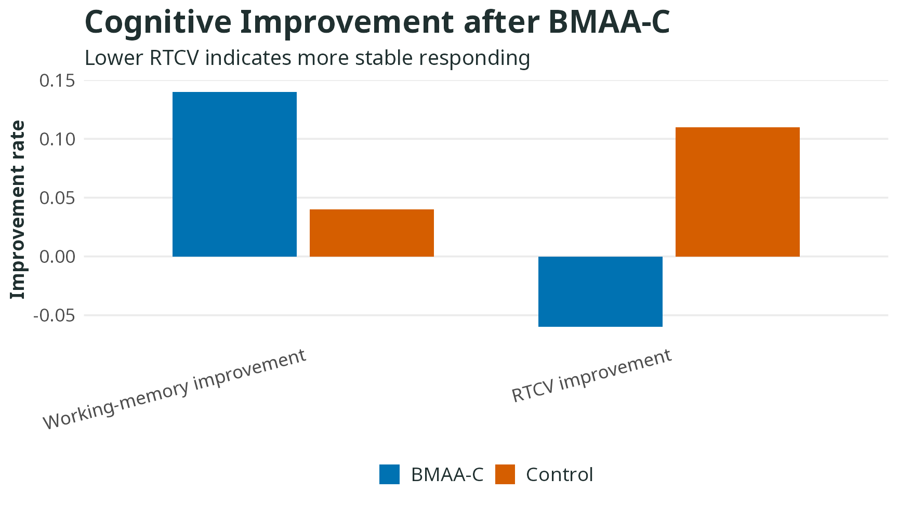

```{r}
#| include: false
source("../../R/bmaa_plot_theme.R")
```

::: {.study-cover}


Cover figure: BMAA-C showed a higher working-memory improvement rate than the control condition.
:::

## Method

A child pretest-posttest control-group study, with additional baseline analyses examining relations between body awareness and executive functions.

## Key Findings

This study suggests that BMAA-C may support children’s working memory. Working memory is the ability to temporarily hold and manipulate information. RTCV reflects stability of sustained attention; lower RTCV generally means more stable responses.

The figure compares improvement rates between BMAA-C and the control group. Higher working-memory improvement is better. For RTCV, a decrease is interpreted as a better trend because lower variability means steadier attention.

```{r}
#| fig-height: 4.8
dat <- data.frame(
  outcome = rep(c("Working-memory improvement", "RTCV improvement"), each = 2),
  group = rep(c("BMAA-C", "Control"), 2),
  value = c(0.14, 0.04, -0.06, 0.11)
)
bmaa_bar_plot(dat, "Cognitive improvement after BMAA-C", ylab = "Improvement rate", subtitle = "Lower RTCV indicates more stable responding")
```

## Reference

李少揚. (2017). *身心互動途徑初探：以「身心中軸覺察訓練」對身體感覺、工作記憶與注意力控制功能的提升效果為例* [碩士論文，國立臺灣大學]. https://doi.org/10.6342/NTU201700254
