This page lists currently summarized BMAA-related studies from newest to oldest. Each card highlights the study direction, key outcomes, and the draft figure currently available.

::: {.study-card-grid}

::: {.study-card}

From body to mind: BMAA enhances body awareness, mindfulness, positive embodiment and mental health

2026 · Tien, Y.-M., Lin, C.-Y., Lien, Y.-W., & Hsu, L.-C.

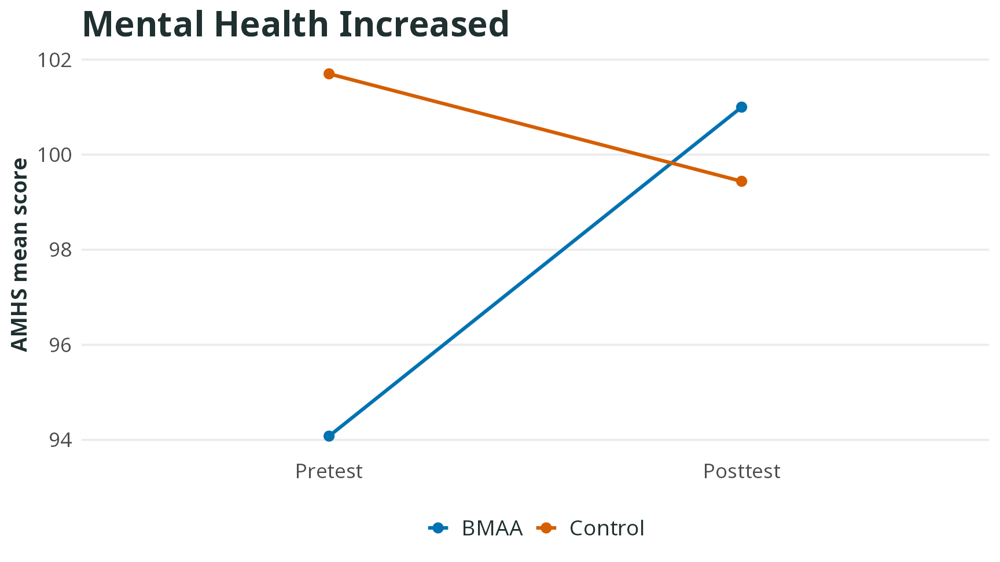

BMAA helped healthcare students become more aware of their bodies and improve mental health and life satisfaction.

<a class="study-card-link" href="2026-tien-healthcare-students.qmd">Read study summary</a>

:::

::: {.study-card}

From the body to the mind: interoception and sense of agency as mechanisms of depression reduction

2026 · Lien, Y.-W., Teng, S.-C., & Wei, L.-Y.

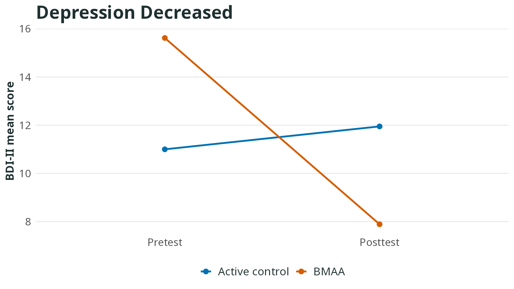

BMAA helped university students reduce depression by strengthening body awareness and a sense of personal control.

<a class="study-card-link" href="2026-lien-depression-agency.qmd">Read study summary</a>

:::

::: {.study-card}

Effects of BMAA combined with lucid-dream therapy on nightmares and sleep quality

2024 · Chiu, C.-H.

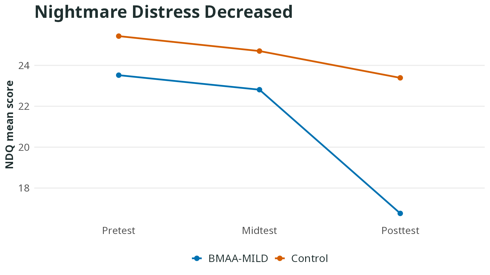

BMAA helped improve sleep quality and reduce the distress caused by nightmares.

<a class="study-card-link" href="2024-chiu-nightmare-lucid-dream.qmd">Read study summary</a>

:::

::: {.study-card}

Improving interoceptive ability to reduce internet addiction tendency

2024 · Mou, S.-C.

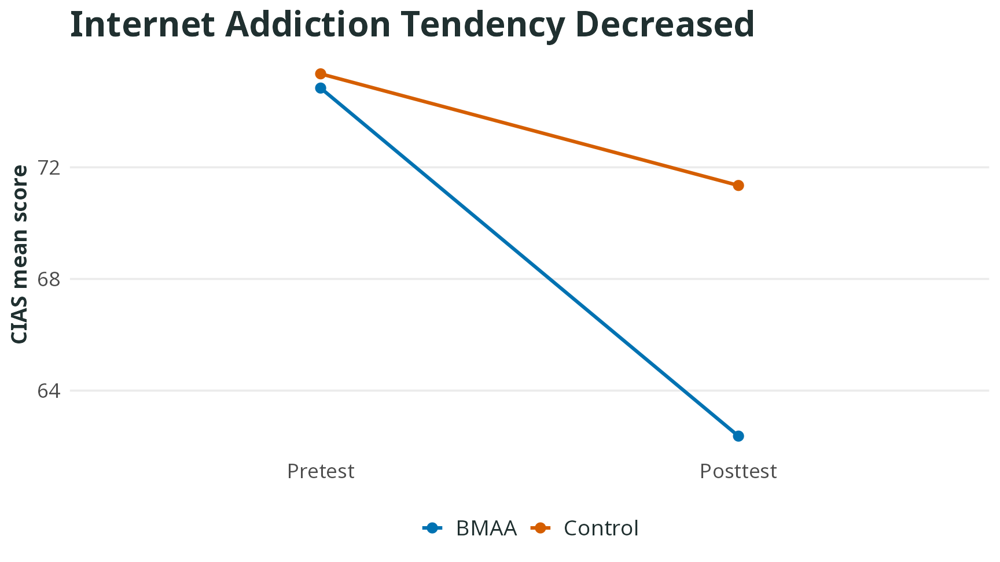

BMAA significantly reduced internet addiction tendency.

<a class="study-card-link" href="2024-mou-internet-addiction.qmd">Read study summary</a>

:::

::: {.study-card}

Effects of BMAA on interoception, alexithymia, and empathy among adults with high autistic traits

2024 · Yang, C.-J.

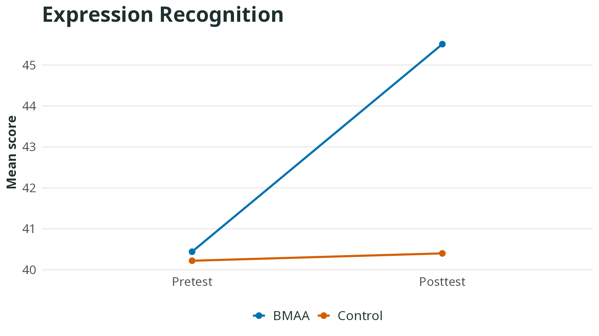

BMAA helped adults with high autistic traits better understand and recognize other people’s emotions.

<a class="study-card-link" href="2024-yang-autistic-traits.qmd">Read study summary</a>

:::

::: {.study-card}

A preliminary study of a camp-based dynamic contemplative course on children’s sustained attention and balance

2023 · Yeh, C.-W., Lien, Y.-W., Chen, R.-Y., Chuang, P.-Y., Cheng, W.-H., & Chen, H.-L.

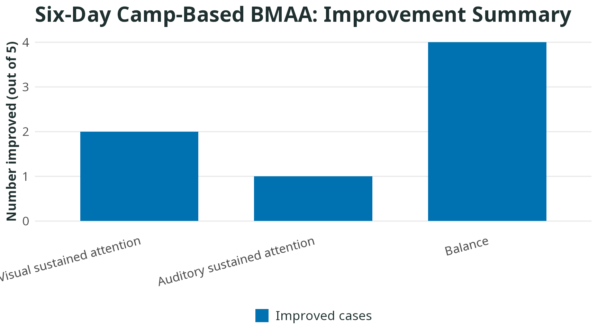

A six-day camp-based BMAA course improved children’s balance and attention.

<a class="study-card-link" href="2023-yeh-camp-attention-balance.qmd">Read study summary</a>

:::

::: {.study-card}

Brief mindfulness guidance reduces implicit gender stereotypes during reading

2023 · Hung, P.-Y., Chen, Y.-Y., & Yeh, L.-H.

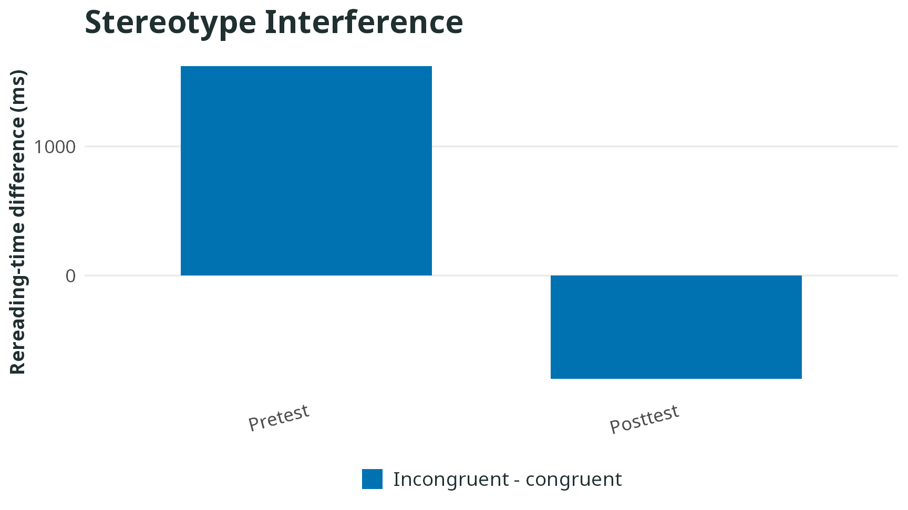

Short-term training with BMAA-derived techniques made readers less likely to have their reading comprehension disrupted by gender stereotypes.

<a class="study-card-link" href="2023-hung-gender-stereotype.qmd">Read study summary</a>

:::

::: {.study-card}

Effects of a short-term dynamic body-mind awareness course on teachers’ stress and resilience

2020 · Weng, W.-T.

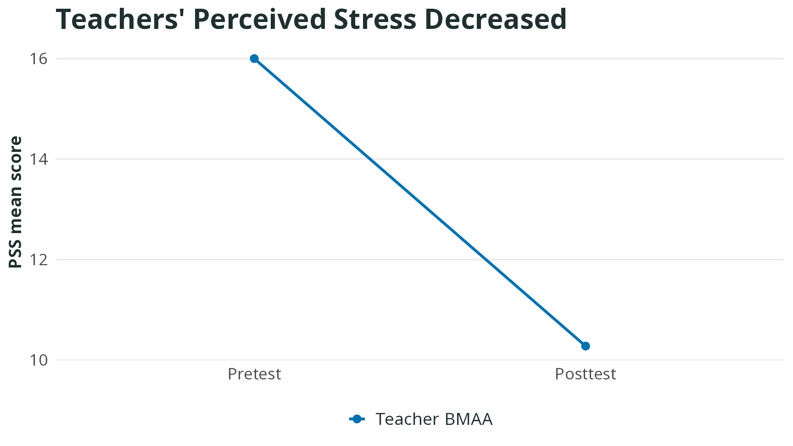

BMAA helped elementary school teachers reduce stress and negative emotions and improve their capacity to recover from stress.

<a class="study-card-link" href="2020-weng-teachers-stress-resilience.qmd">Read study summary</a>

:::

::: {.study-card}

Effects of a two-week BMAA practice on emotion regulation among university students

2020 · Hsu, W.-C.

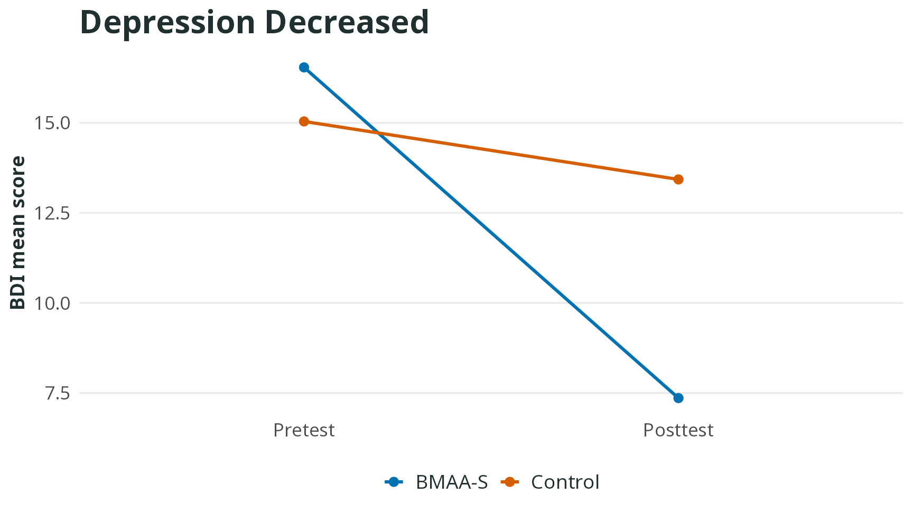

Short-term BMAA helped university students reduce depression tendency and emotion-regulation difficulties.

<a class="study-card-link" href="2020-hsu-emotion-regulation.qmd">Read study summary</a>

:::

::: {.study-card}

Feel your body: short-term in-class dynamic contemplative practice for children

2019 · Lee, M.-N.

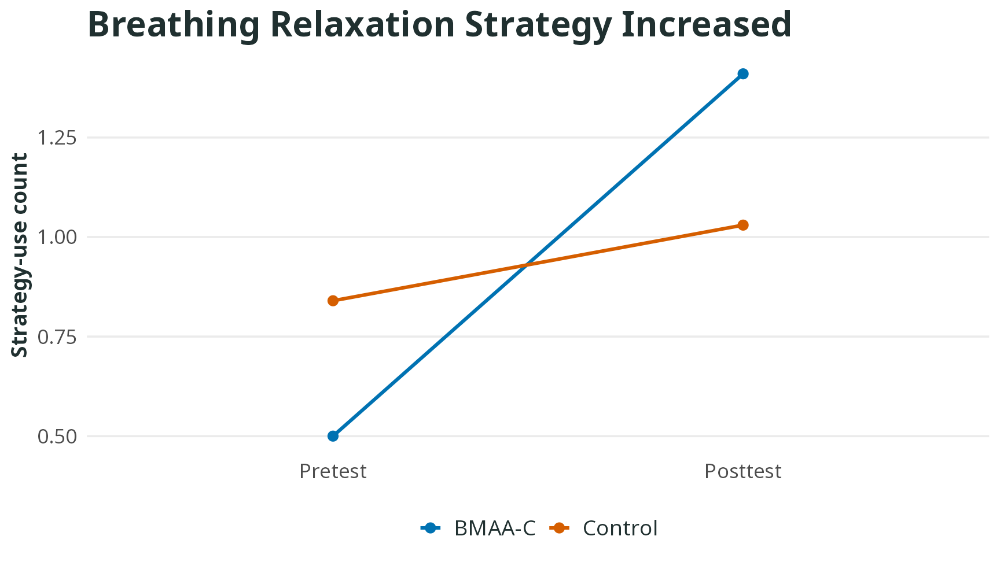

BMAA-C may help children use helpful strategies such as breathing relaxation and thinking from a different perspective when they feel upset.

<a class="study-card-link" href="2019-lee-feel-your-body.qmd">Read study summary</a>

:::

::: {.study-card}

BMAA and integrated activity training for improving children’s executive function and emotion regulation

2018 · Chang, Y.-J.

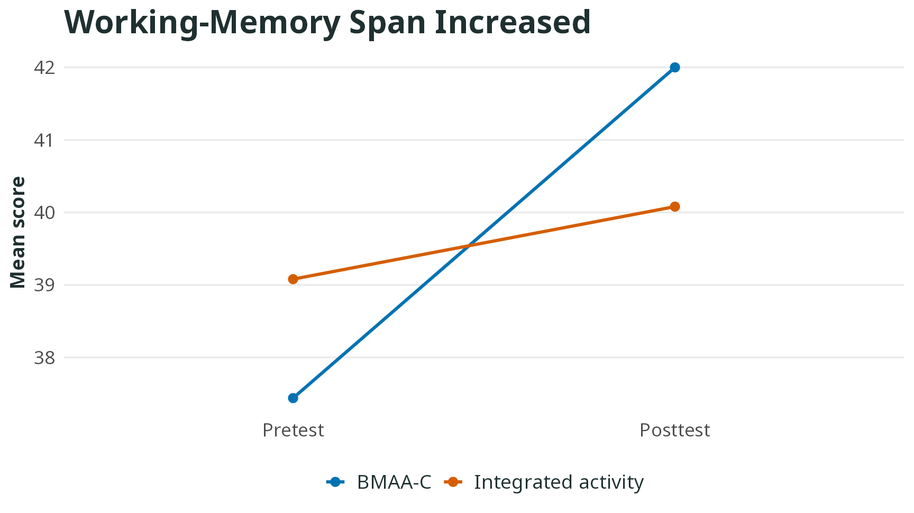

Children’s BMAA improved the trained children’s brain power, especially working memory.

<a class="study-card-link" href="2018-chang-children-executive-emotion.qmd">Read study summary</a>

:::

::: {.study-card}

An initial exploration of body-mind interaction: effects of BMAA on body sensation, working memory, and attentional control

2017 · Lee, S.-Y.

Children’s BMAA helped children improve brain power and attention.

<a class="study-card-link" href="2017-lee-body-mind-interaction.qmd">Read study summary</a>

:::

::: {.study-card}

What Confucius practiced is good for your mind: contemplative practice and executive functions

2016 · Teng, S.-C., & Lien, Y.-W.

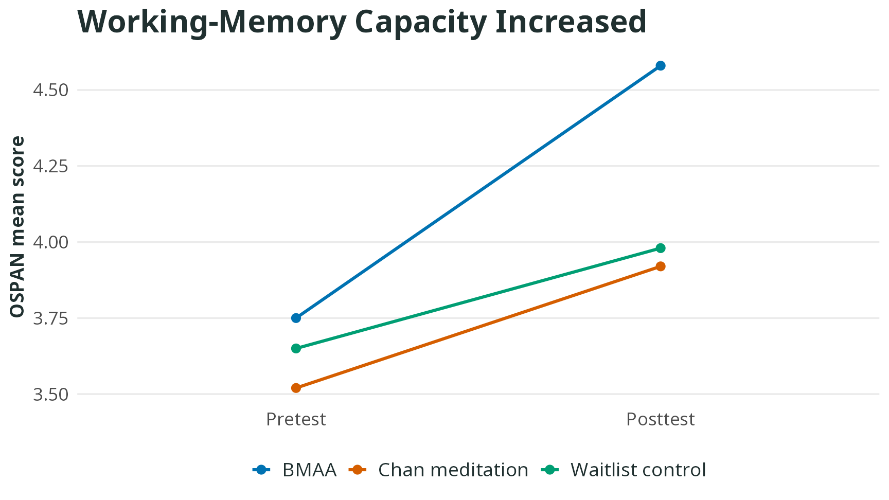

Short-term BMAA improved trainees’ brain power, especially working memory.

<a class="study-card-link" href="2016-teng-confucius.qmd">Read study summary</a>

:::

:::
