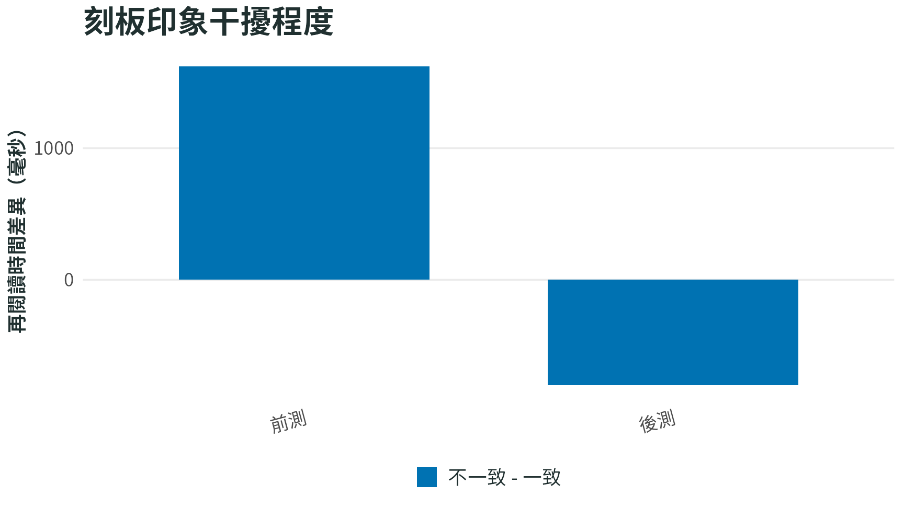

```{r}
#| include: false
source("../R/bmaa_plot_theme.R")
```

::: {.study-cover}


封面圖：結合 BMAA 技巧訓練後，一致與不一致文章的再閱讀時間差異下降。
:::

## 短期正念引導降低閱讀時的內隱性別刻板印象

### 方法
- 實驗設計：三因子混合設計；組別（正念引導 vs 等待控制）× 文章一致性（一致 vs 不一致）× 時間（前測 vs 後測）。
- 實驗組（27 人） vs 等待控制組（31 人）。
- 介入：三次短期正念引導，每次約 30 分鐘；包含源自 BMAA 的舌根運動、眼球運動、單鼻孔呼吸作為暖身，接續觀呼吸與身體掃描。
- 主要依變項：眼動閱讀指標，尤其性別特質詞彙與段落的再閱讀時間。再閱讀時間越長，代表讀者越可能覺得內容不符合預期，需要回頭重新理解。

### 主要發現

這篇研究用眼動資料觀察讀者是否因性別刻板印象被打破而回頭多讀。再閱讀時間越長，代表讀者越可能覺得內容不符合預期、需要重新理解。若「不一致」文章引發較長再閱讀，表示內隱性別刻板印象正在影響閱讀。

圖中正念引導組在後測時，不一致文章的再閱讀時間下降，原本「看到不符合性別刻板印象內容就回頭多讀」的現象變弱；控制組則沒有呈現同樣模式。這表示短期正念引導可能降低閱讀中的內隱性別刻板印象。

```{r}
#| fig-height: 4.8
dat <- data.frame(
  outcome = "第三段再閱讀時間",
  group = rep(c("正念-一致", "正念-不一致", "控制-一致", "控制-不一致"), each = 2),
  time = rep(c("前測", "後測"), 4),
  value = c(1551.94, 2566.15, 3173.46, 1765.30, 2106.19, 1711.23, 2012.86, 1739.40)
)
bmaa_facet_line_plot(dat, "短期正念引導降低閱讀中的性別不一致效應", ylab = "再閱讀時間（毫秒）")
```


## 參考文獻

洪珮瑩, 陳苡禕, & 葉理豪. (2023). 短期正念引導降低閱讀時的內隱性別刻板印象. *教育心理學報, 54*(3), 515-536. https://doi.org/10.6251/BEP.202303_54(3).0001
