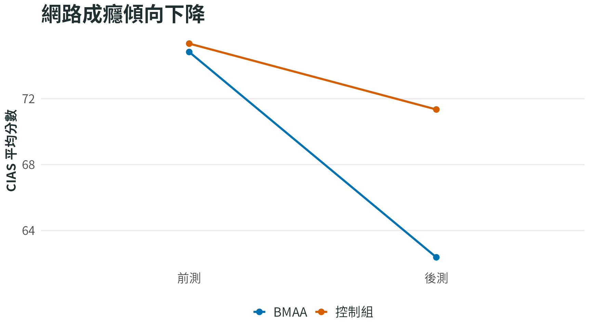

```{r}
#| include: false
source("../R/bmaa_plot_theme.R")
```

::: {.study-cover}


封面圖：BMAA 組的 CIAS 總分與網路成癮核心症狀在訓練後下降。
:::

## 內感覺能力提升對於降低網路成癮傾向的影響

### 方法
- 實驗設計：隨機分派之前後測控制組設計。
- 實驗組（BMAA，19 人納入分析） vs 控制組（20 人納入分析）；參與者 CIAS 總分皆大於或等於 58。（青少年網路沉迷切分標準為58）
- 介入：6 週、每週 2 小時、共 12 小時 BMAA 課程，並要求每日居家自我練習；控制組不接受介入。
- 主要依變項：
  - 網路成癮傾向（CIAS）：包含總分、網路成癮核心症狀與網路成癮相關問題。核心症狀分量表包含強迫性上網、戒斷症狀與耐受性；相關問題分量表包含人際與健康問題、時間管理問題。
  - 網路使用習慣與手機紀錄
  - 內感覺覺察（MAIA-C）
  - 內感覺準確度（IAc，心跳偵測作業）

### 主要發現

BMAA 訓練後，參與者的網路成癮核心症狀與 CIAS 總分下降，同時內感覺覺察與內感覺準確度提升。也就是說，BMAA 組不只在主觀網路成癮傾向上改善，也更能覺察身體訊號，並在心跳偵測作業中更準確地感覺自己的身體狀態。

具體來說：

- 網路成癮傾向（CIAS）：BMAA 組的 CIAS 總分與網路成癮核心症狀下降，且後測分數低於控制組。相關問題分量表也隨時間下降，但兩組變化差異較不明顯。
- 網路使用習慣與手機紀錄：手機使用紀錄與使用情境沒有呈現明確的介入效果，因此本頁不把手機紀錄列為主要成效圖。
- 內感覺覺察（MAIA-C）：BMAA 組的 MAIA-C 總分提升，表示參與者更能注意、辨識並理解自己的身體訊號。
- 內感覺準確度（IAc）：BMAA 組在心跳偵測作業中的準確度提升，表示對身體內在訊號的偵測更準確。

```{r}
#| fig-height: 4.8
dat <- data.frame(
  outcome = rep(c("CIAS 總分", "網路成癮核心症狀"), each = 4),
  group = rep(c("BMAA", "BMAA", "控制組", "控制組"), 2),
  time = rep(c("前測", "後測", "前測", "後測"), 2),
  value = c(74.84, 62.37, 75.35, 71.35, 41.79, 35.26, 42.90, 40.65)
)
bmaa_facet_line_plot(dat, "BMAA 降低網路成癮傾向", ylab = "平均分數")
```

```{r}
#| fig-height: 4.8
dat <- data.frame(
  outcome = rep(c("MAIA-C 總分", "內感覺準確度 IAc"), each = 4),
  group = rep(c("BMAA", "BMAA", "控制組", "控制組"), 2),
  time = rep(c("前測", "後測", "前測", "後測"), 2),
  value = c(89.68, 100.84, 95.25, 85.70, 0.64, 0.79, 0.65, 0.70)
)
bmaa_facet_line_plot(
  dat,
  "BMAA 提升內感覺覺察與心跳偵測準確度",
  ylab = "平均分數"
)
```

#### 中介機制

```{mermaid}
flowchart LR
  X["BMAA 訓練"]
  M["提升內感覺覺察<br/>MAIA-C 分數上升"]
  Y["降低主觀網路成癮傾向<br/>CIAS 總分下降"]

  X --> M --> Y
```

中介分析支持的重點是：BMAA 訓練可能先提升參與者的內感覺覺察，也就是更能注意、辨識並理解自己的身體訊號；而內感覺覺察提升後，主觀網路成癮傾向（CIAS 總分）也跟著下降。

因此，這篇研究的重要性在於把「主觀網路成癮傾向」放回身體覺察的脈絡中理解：當一個人更能感覺身體狀態，也可能更容易覺察自己正在被網路使用衝動帶走，進而降低自陳的網路成癮傾向。


## 參考文獻

牟書琪. (2024). *內感覺能力提升對於降低網路成癮傾向的影響：以身心中軸覺察訓練為介入的效果與機制探討* [碩士論文，中原大學].
