本頁依年份由新至舊列出目前已整理的 BMAA 相關研究。每一頁包含研究方法、主要結果與目前可用的繪圖資料草稿。

::: {.study-card-grid}

::: {.study-card}

From body to mind: how body-mind axial awareness training enhances body awareness, mindfulness, positive embodiment and mental health in healthcare students

2026 · Tien, Y.-M., Lin, C.-Y., Lien, Y.-W., & Hsu, L.-C.

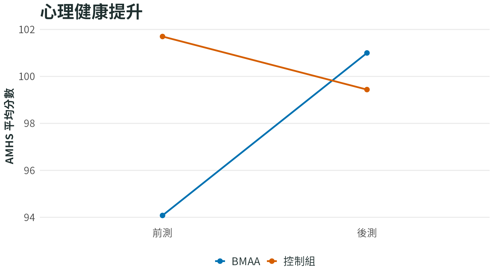

BMAA 幫助醫療相關科系學生更能覺察自己的身體，並提升心理健康與生活滿意度。

<a class="study-card-link" href="2026-tien-healthcare-students.qmd">閱讀研究摘要</a>

:::

::: {.study-card}

From the body to the mind: interoception and sense of agency as mechanisms of depression reduction in the Body–Mind Axial Awareness (BMAA)

2026 · Lien, Y.-W., Teng, S.-C., & Wei, L.-Y.

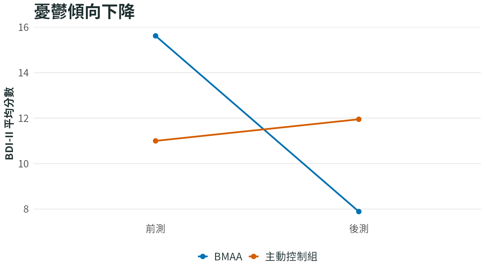

BMAA 透過提升對自己身體覺察能力與自我掌控感，幫助大學生降低憂鬱傾向。

<a class="study-card-link" href="2026-lien-depression-agency.qmd">閱讀研究摘要</a>

:::

::: {.study-card}

身心中軸覺察訓練結合清醒夢療法對惡夢困擾者的清醒夢、惡夢與睡眠品質的影響

2024 · 邱敬惠

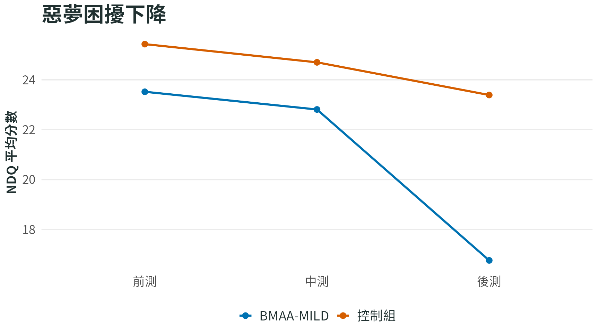

BMAA 有助於改善睡眠品質並減少惡夢帶來的困擾。

<a class="study-card-link" href="2024-chiu-nightmare-lucid-dream.qmd">閱讀研究摘要</a>

:::

::: {.study-card}

內感覺能力提升對於降低網路成癮傾向的影響：以身心中軸覺察訓練為介入的效果與機制探討

2024 · 牟書琪

BMAA 顯著降低網路成癮傾向。

<a class="study-card-link" href="2024-mou-internet-addiction.qmd">閱讀研究摘要</a>

:::

::: {.study-card}

身心中軸覺察對於高自閉症特質成年人之內感覺、述情障礙及同理心的影響

2024 · 楊捷如

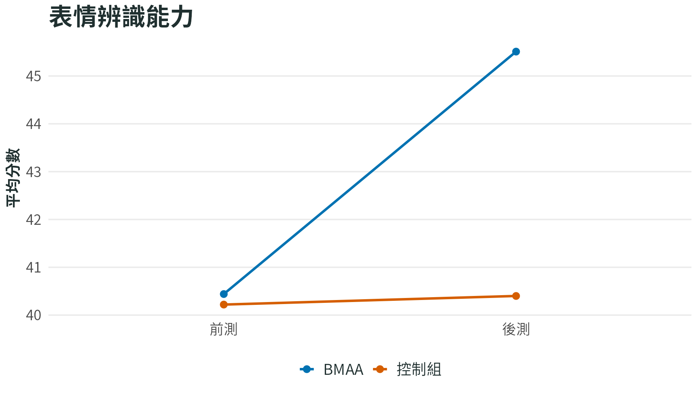

BMAA 幫助高自閉症特質成人更能理解與辨識他人的情緒。

<a class="study-card-link" href="2024-yang-autistic-traits.qmd">閱讀研究摘要</a>

:::

::: {.study-card}

營隊式動態靜觀課程對兒童持續注意力與平衡能力影響之初探

2023 · 葉淨維, 連韻文, 陳人瑜, 莊博雅, 鄭惟馨, & 陳顥齡

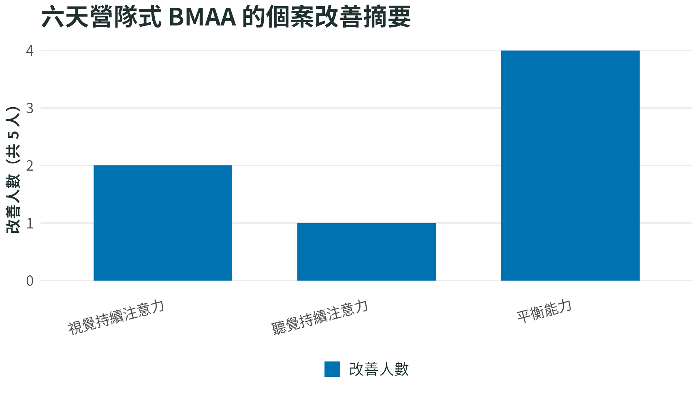

六天營隊式 BMAA 能改善兒童平衡能力以及注意力。

<a class="study-card-link" href="2023-yeh-camp-attention-balance.qmd">閱讀研究摘要</a>

:::

::: {.study-card}

短期正念引導降低閱讀時的內隱性別刻板印象

2023 · 洪珮瑩, 陳苡禕, & 葉理豪

短期結合 BMAA 技巧訓練讓讀者較不容易被性別刻板印象干擾閱讀理解。

<a class="study-card-link" href="2023-hung-gender-stereotype.qmd">閱讀研究摘要</a>

:::

::: {.study-card}

探討短期動態身心覺察課程對國小教師內感覺覺察、心理韌性與壓力知覺的介入成效

2020 · 翁宛婷

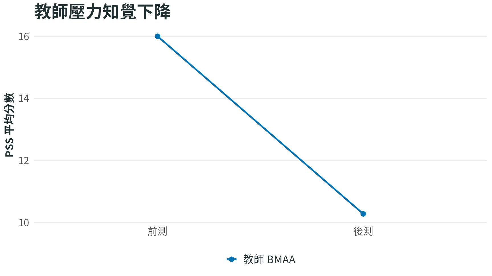

BMAA 能幫助國小教師降低壓力與負面情緒，並提升面對壓力後的恢復力。

<a class="study-card-link" href="2020-weng-teachers-stress-resilience.qmd">閱讀研究摘要</a>

:::

::: {.study-card}

探討兩週身心中軸覺察練習對大學生情緒調節的成效及覺察傾向、工作記憶的中介角色

2020 · 許惟智

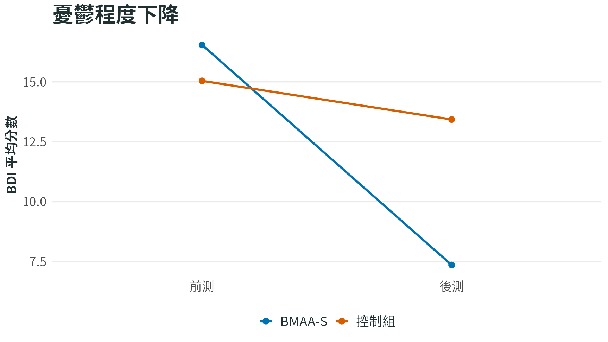

短期 BMAA 能幫助大學生降低憂鬱傾向與情緒調節困難。

<a class="study-card-link" href="2020-hsu-emotion-regulation.qmd">閱讀研究摘要</a>

:::

::: {.study-card}

感覺你的身體：短期入班動態靜觀課程對學童內感覺、執行控制功能、情緒調節及運動協調之介入成效

2019 · 李茂寧

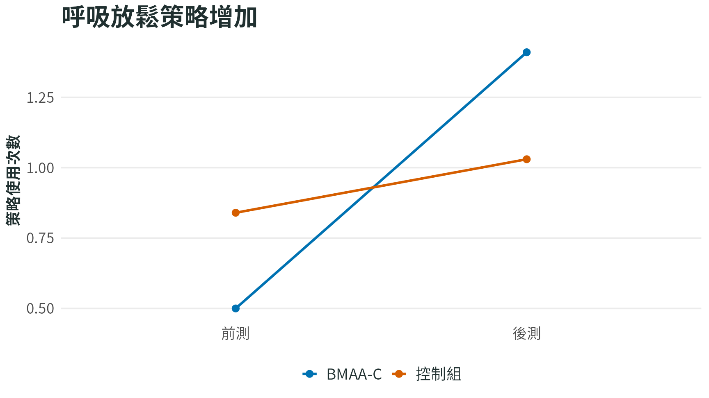

BMAA-C 可能幫助兒童在情緒不好時，更常用呼吸放鬆與換角度思考等好的策略來調整自己。

<a class="study-card-link" href="2019-lee-feel-your-body.qmd">閱讀研究摘要</a>

:::

::: {.study-card}

身心中軸覺察與綜合活動訓練增進兒童執行功能及情緒調節

2018 · 張憶如

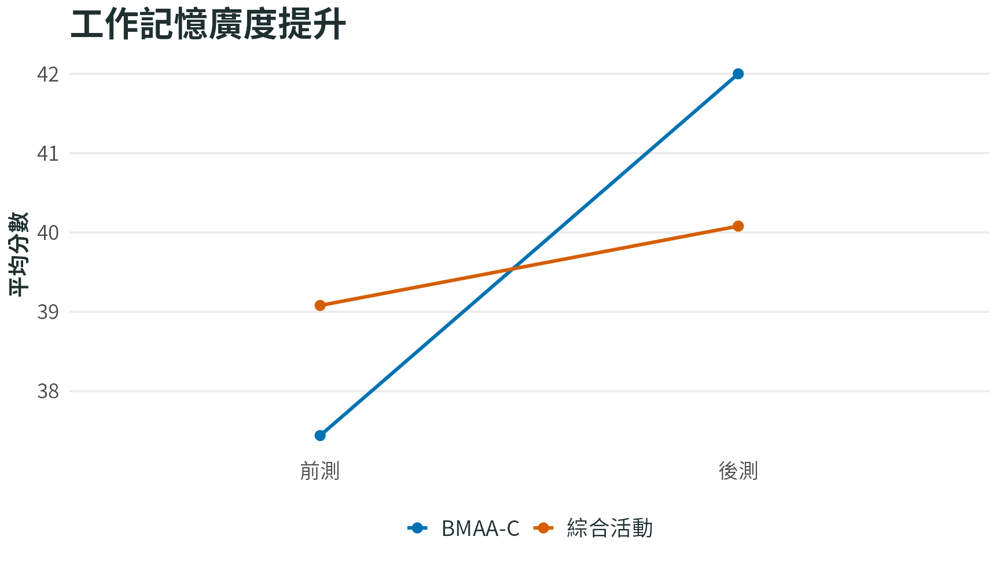

兒童版 BMAA 提升受訓兒童的腦力（工作記憶力）。

<a class="study-card-link" href="2018-chang-children-executive-emotion.qmd">閱讀研究摘要</a>

:::

::: {.study-card}

身心互動途徑初探：以「身心中軸覺察訓練」對身體感覺、工作記憶與注意力控制功能的提升效果為例

2017 · 李少揚

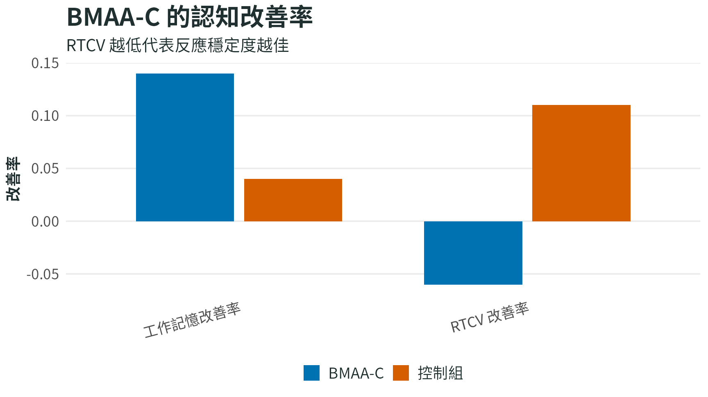

兒童版 BMAA 幫助孩子提升腦力以及注意力。

<a class="study-card-link" href="2017-lee-body-mind-interaction.qmd">閱讀研究摘要</a>

:::

::: {.study-card}

What Confucius practiced is good for your mind: Examining the effect of a contemplative practice in Confucian tradition on executive functions

2016 · Teng, S.-C., & Lien, Y.-W.

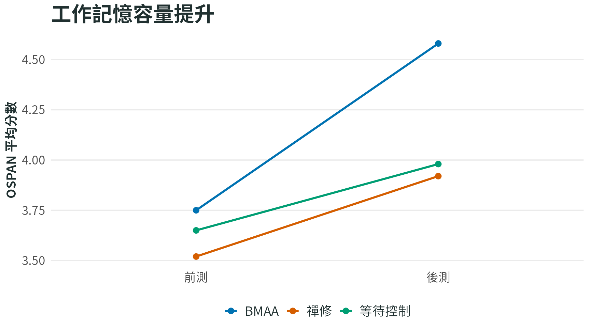

短期 BMAA 提升受訓學員的腦力（工作記憶力）。

<a class="study-card-link" href="2016-teng-confucius.qmd">閱讀研究摘要</a>

:::

:::
